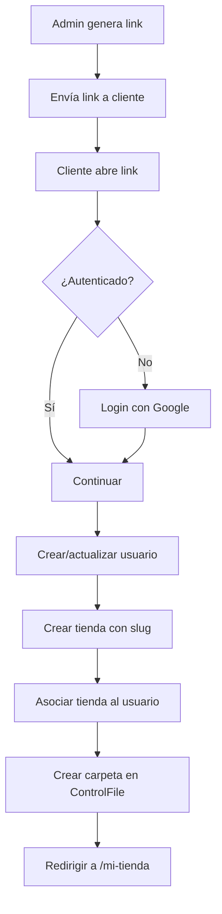
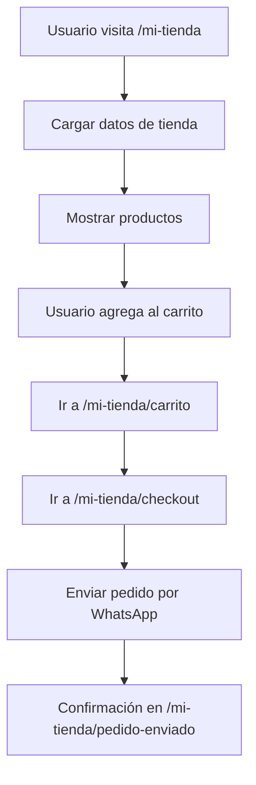
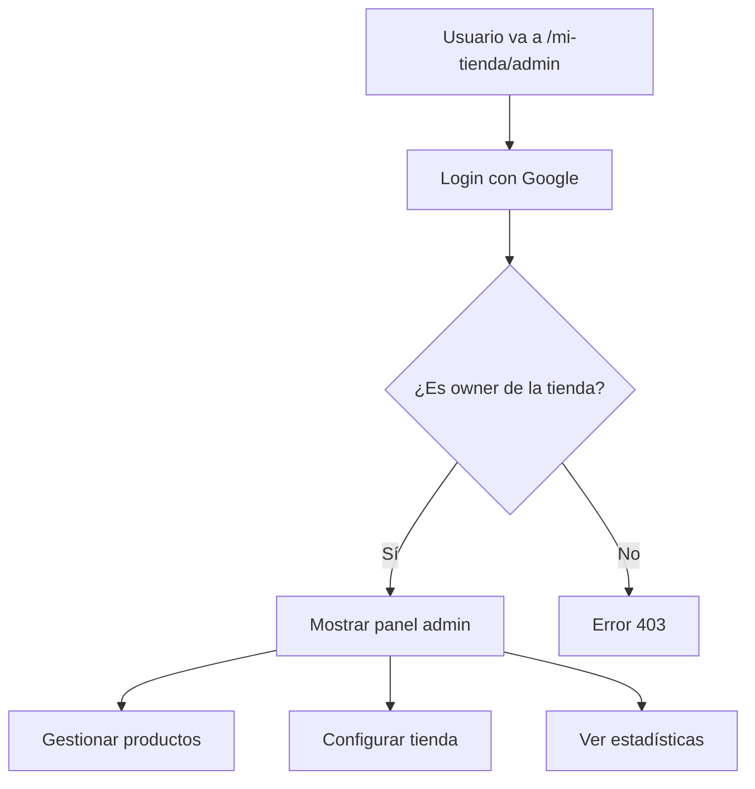

# 🏪 Sistema Multi-Tenant de Tiendas - Documentación Completa

## 📋 Índice

1. [Resumen del Sistema](#resumen-del-sistema)
2. [Arquitectura](#arquitectura)
3. [Estructura de Datos](#estructura-de-datos)
4. [Flujos de Usuario](#flujos-de-usuario)
5. [API y Funciones](#api-y-funciones)
6. [Configuración](#configuración)
7. [Despliegue](#despliegue)
8. [Mantenimiento](#mantenimiento)

---

## 🎯 Resumen del Sistema

### ¿Qué es?
Sistema SaaS multi-tenant que permite a los usuarios crear y gestionar múltiples tiendas online con URLs personalizadas.

### Características principales
- ✅ **URLs personalizadas**: `tu-dominio.com/nombre-tienda`
- ✅ **Múltiples tiendas por usuario**: Un email puede tener varias tiendas
- ✅ **Registro por invitación**: Links únicos que expiran
- ✅ **Google Auth**: Autenticación compartida con ControlFile
- ✅ **Panel admin por tienda**: Gestión individual de cada tienda
- ✅ **Integración ControlFile**: Carpetas en taskbar
- ✅ **Firestore compartido**: Estructura organizada en `apps/control-store/`

---

## 🏗️ Arquitectura

### Estructura de Rutas
```
/                           → Landing page
/admin                      → Login admin principal
/admin/dashboard            → Panel admin (generar links)
/admin/signup/[token]       → Registro con link único
/[storeSlug]                → Tienda pública
/[storeSlug]/carrito        → Carrito de la tienda
/[storeSlug]/checkout       → Checkout de la tienda
/[storeSlug]/pedido-enviado → Confirmación de pedido
/[storeSlug]/admin          → Panel admin de la tienda (PENDIENTE)
```

### Tecnologías
- **Frontend**: Next.js 14, React 19, TypeScript
- **UI**: TailwindCSS, Shadcn/ui
- **Estado**: Zustand
- **Base de datos**: Firestore (compartido con ControlFile)
- **Auth**: Firebase Auth (compartido)
- **Deploy**: Vercel

---

## 🗂️ Estructura de Datos

### Firestore (Compartido con ControlFile)
```
apps/
└── control-store/
    ├── users/              # Usuarios del sistema
    │   └── {userId}/
    ├── stores/             # Tiendas
    │   └── {storeId}/
    │       └── products/   # Productos por tienda
    │           └── {productId}/
    └── invitations/        # Links de invitación
        └── {invitationId}/

files/                      # Colección compartida (ControlFile)
└── {fileId}/              # Carpetas de tiendas en taskbar
```

### Colecciones Detalladas

#### `apps/control-store/users`
```typescript
{
  id: "firebase-user-id",
  email: "juan@gmail.com",
  displayName: "Juan Pérez",
  stores: ["store_1", "store_2", "store_3"], // Array de IDs de tiendas
  createdAt: Timestamp,
  updatedAt: Timestamp
}
```

#### `apps/control-store/stores`
```typescript
{
  id: "store_abc123",
  slug: "pizzas-don-juan",        // URL: /pizzas-don-juan
  name: "Pizzas Don Juan",
  ownerEmail: "juan@gmail.com",
  ownerId: "firebase-user-id",
  config: {
    name: "Pizzas Don Juan",
    phone: "+54 9 2944 99-7155",
    address: "Calle 123, Buenos Aires",
    deliveryFee: 500,
    minOrderAmount: 2000,
    openingHours: "Lun-Dom 11:00 - 23:00"
  },
  createdAt: Timestamp,
  updatedAt: Timestamp
}
```

#### `apps/control-store/stores/{storeId}/products`
```typescript
{
  id: "prod_123",
  name: "Pizza Muzzarella",
  description: "Clásica pizza con muzzarella",
  basePrice: 4500,
  image: "/placeholder.svg",
  category: "pizzas",
  section: "destacados",
  variants: [
    { id: "pequeña", name: "Pequeña", price: 4500 },
    { id: "mediana", name: "Mediana", price: 6000 }
  ],
  complements: [
    { id: "aceitunas", name: "Aceitunas", price: 300 }
  ],
  available: true,
  featured: true,
  createdAt: Timestamp,
  updatedAt: Timestamp
}
```

#### `apps/control-store/invitations`
```typescript
{
  id: "inv_xyz789",
  token: "link-secreto-123",
  storeName: "Nueva Tienda",
  used: false,
  usedByEmail: null,
  usedById: null,
  expiresAt: Timestamp, // 7 días
  createdAt: Timestamp
}
```

#### `files` (ControlFile compartido)
```typescript
{
  id: "store-abc123-main",
  userId: "firebase-user-id",
  name: "Pizzas Don Juan",
  type: "folder",
  parentId: null,
  metadata: {
    source: "taskbar",
    icon: "Taskbar",
    color: "text-blue-600",
    storeId: "abc123"
  }
}
```

---

## 👥 Flujos de Usuario

### 1. Flujo de Registro (Link Único)



**Pasos detallados:**
1. Admin va a `/admin/dashboard`
2. Tab "Invitaciones" → Ingresa nombre → Genera link
3. Copia y envía link: `tu-dominio.com/admin/signup/abc123`
4. Cliente abre link → Login con Google
5. Sistema crea/actualiza documento en `users`
6. Cliente ingresa nombre de tienda → Sistema genera slug
7. Se crea tienda en `stores`
8. Se asocia tienda al usuario en `users.stores[]`
9. Se crea carpeta en ControlFile taskbar
10. Redirección a `tu-dominio.com/mi-tienda`

### 2. Flujo de Tienda Pública



### 3. Flujo de Admin (Pendiente)



---

## 🔧 API y Funciones

### Gestión de Usuarios

```typescript
// Crear o actualizar documento de usuario
await ensureUserDocument(userId: string, email: string, displayName?: string)

// Agregar tienda al array de stores del usuario
await addStoreToUser(userId: string, storeId: string)

// Obtener todas las tiendas de un usuario
const stores = await getUserStores(userId: string)

// Verificar si un usuario es owner de una tienda específica
const isOwner = await isUserOwnerOfStore(userId: string, storeSlug: string)
```

### Gestión de Tiendas

```typescript
// Crear tienda
const storeId = await createStore(data: Omit<Store, 'id' | 'createdAt' | 'updatedAt'>)

// Obtener tienda por slug
const store = await getStoreBySlug(slug: string)

// Obtener tienda por ID
const store = await getStoreById(id: string)

// Actualizar configuración de tienda
await updateStoreConfig(storeId: string, config: Partial<Store['config']>)

// Verificar disponibilidad de slug
const available = await isSlugAvailable(slug: string)

// Generar slug desde nombre
const slug = generateSlug(name: string)
```

### Gestión de Invitaciones

```typescript
// Crear link de invitación
const token = await createInvitation(storeName: string)

// Obtener invitación por token
const invitation = await getInvitationByToken(token: string)

// Marcar invitación como usada
await markInvitationAsUsed(token: string, email: string, userId: string)
```

### Tipos TypeScript

```typescript
interface User {
  id: string
  email: string
  displayName: string
  stores: string[] // Array de IDs de tiendas
  createdAt: Date | any
  updatedAt: Date | any
}

interface Store {
  id: string
  slug: string
  name: string
  ownerEmail: string
  ownerId: string
  config: StoreConfig
  createdAt: Date | any
  updatedAt: Date | any
}

interface StoreConfig {
  name: string
  phone: string
  address: string
  deliveryFee: number
  minOrderAmount: number
  openingHours: string
}

interface Invitation {
  id: string
  token: string
  storeName: string
  used: boolean
  usedByEmail?: string
  usedById?: string
  expiresAt: Date | any
  createdAt: Date | any
}
```

---

## ⚙️ Configuración

### Variables de Entorno

```env
# .env.local
NEXT_PUBLIC_REBASE_API_KEY=tu-api-key
NEXT_PUBLIC_REBASE_AUTH_DOMAIN=tu-proyecto.firebaseapp.com
NEXT_PUBLIC_REBASE_PROJECT_ID=tu-proyecto
NEXT_PUBLIC_REBASE_STORAGE_BUCKET=tu-proyecto.appspot.com
NEXT_PUBLIC_REBASE_MESSAGING_SENDER_ID=123456789
NEXT_PUBLIC_REBASE_APP_ID=tu-app-id
BACKEND_URL=https://controlfile.tu-url.com
```

### Instalación

```bash
# Instalar dependencias
pnpm install

# Ejecutar en desarrollo
pnpm dev

# Construir para producción
pnpm build

# Iniciar en producción
pnpm start
```

### Dependencias Principales

```json
{
  "firebase": "^12.4.0",
  "react-firebase-hooks": "^5.1.1",
  "next": "^16.0.0",
  "react": "^19.0.0",
  "zustand": "^5.0.8"
}
```

---

## 🚀 Despliegue

### Vercel (Recomendado)

1. **Conectar repositorio** a Vercel
2. **Configurar variables de entorno** en Vercel Dashboard
3. **Deploy automático** desde main branch

### Variables de Entorno en Vercel

```
NEXT_PUBLIC_REBASE_API_KEY = tu-api-key
NEXT_PUBLIC_REBASE_AUTH_DOMAIN = tu-proyecto.firebaseapp.com
NEXT_PUBLIC_REBASE_PROJECT_ID = tu-proyecto
NEXT_PUBLIC_REBASE_STORAGE_BUCKET = tu-proyecto.appspot.com
NEXT_PUBLIC_REBASE_MESSAGING_SENDER_ID = 123456789
NEXT_PUBLIC_REBASE_APP_ID = tu-app-id
BACKEND_URL = https://controlfile.tu-url.com
```

### Configuración de Dominio

- **Producción**: `tu-dominio.com`
- **Desarrollo**: `localhost:3000`
- **Staging**: `tu-app.vercel.app`

---

## 🔧 Mantenimiento

### Monitoreo

1. **Logs de Vercel**: Revisar errores en dashboard
2. **Firestore**: Monitorear uso de colecciones
3. **Firebase Auth**: Verificar usuarios activos

### Backup

```bash
# Backup de Firestore (usando Firebase CLI)
firebase firestore:export gs://tu-bucket/backup-$(date +%Y%m%d)

# Backup de Storage (si se usa)
gsutil -m cp -r gs://tu-bucket/storage gs://tu-bucket/backup-storage-$(date +%Y%m%d)
```

### Actualizaciones

1. **Dependencias**: `pnpm update`
2. **Next.js**: Seguir guía de migración
3. **Firebase**: Actualizar SDK cuando sea necesario

### Escalabilidad

- **Firestore**: Escala automáticamente
- **Vercel**: Escala automáticamente
- **Firebase Auth**: Escala automáticamente

---

## 📊 Métricas y Analytics

### Métricas Importantes

1. **Tiendas creadas** por día/semana
2. **Usuarios activos** por mes
3. **Pedidos procesados** por tienda
4. **Tiempo de carga** de páginas

### Herramientas

- **Vercel Analytics**: Métricas de rendimiento
- **Firebase Analytics**: Eventos de usuario
- **Firestore**: Consultas de datos

---

## 🛠️ Desarrollo

### Estructura de Archivos

```
├── app/
│   ├── [storeSlug]/           # Rutas dinámicas de tiendas
│   │   ├── page.tsx           # Tienda pública
│   │   ├── layout.tsx         # Layout de tienda
│   │   ├── carrito/page.tsx   # Carrito
│   │   ├── checkout/page.tsx  # Checkout
│   │   └── pedido-enviado/page.tsx
│   ├── admin/
│   │   ├── page.tsx           # Login admin
│   │   ├── dashboard/page.tsx # Panel admin
│   │   └── signup/[token]/page.tsx
│   └── globals.css
├── components/
│   ├── admin/
│   │   ├── invitation-link-generator.tsx
│   │   └── product-form.tsx
│   ├── ui/                    # Componentes base
│   └── cart-item-card.tsx
├── lib/
│   ├── firebase.ts            # Config Firebase
│   ├── stores.ts              # CRUD de tiendas
│   ├── types.ts               # Tipos TypeScript
│   └── whatsapp.ts            # Integración WhatsApp
├── middleware.ts               # Validación de rutas
└── vercel.json                # Config Vercel
```

### Convenciones

- **Rutas**: kebab-case (`/mi-tienda`)
- **Componentes**: PascalCase (`ProductCard`)
- **Funciones**: camelCase (`createStore`)
- **Variables**: camelCase (`storeName`)
- **Tipos**: PascalCase (`Store`, `User`)

---

## 🚨 Troubleshooting

### Problemas Comunes

1. **Error de autenticación**
   - Verificar variables de entorno
   - Revisar configuración de Firebase

2. **Tienda no encontrada**
   - Verificar slug en URL
   - Revisar colección `stores` en Firestore

3. **Error de permisos**
   - Verificar reglas de Firestore
   - Revisar ownership de tienda

4. **Link de invitación no funciona**
   - Verificar expiración
   - Revisar si ya fue usado

### Logs Útiles

```typescript
// En desarrollo
console.log('Store data:', storeData)
console.log('User stores:', userStores)

// En producción
console.error('Error creating store:', error)
```

---

## 📞 Soporte

### Documentación Adicional

- [MULTI_TENANT_README.md](./MULTI_TENANT_README.md) - Guía rápida
- [FLUJO_CORREGIDO.md](./FLUJO_CORREGIDO.md) - Cambios realizados
- [CAMBIOS_FIRESTORE_COMPARTIDO.md](./CAMBIOS_FIRESTORE_COMPARTIDO.md) - Estructura compartida

### Contacto

- **Issues**: Crear issue en GitHub
- **Email**: soporte@tu-dominio.com
- **Documentación**: [docs.tu-dominio.com](https://docs.tu-dominio.com)

---

## 🎉 Conclusión

Sistema multi-tenant completo y funcional que permite:

- ✅ Crear múltiples tiendas por usuario
- ✅ URLs personalizadas por tienda
- ✅ Registro por invitación única
- ✅ Integración con ControlFile
- ✅ Panel de administración
- ✅ Escalabilidad y mantenimiento

**¡Sistema listo para producción! 🚀**

---

*Última actualización: $(date)*
